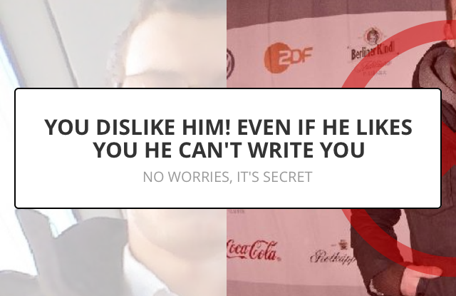

YCTutorialBox
=============
[](http://cocoadocs.org/docsets/YCTutorialBox/)
[](http://cocoadocs.org/docsets/YCTutorialBox/)
[](https://github.com/yuppiu/YCTutorialBox/blob/master/LICENSE)
[](https://www.versioneye.com/objective-c/YCTutorialBox)



[Full screen](YCTutorialBoxSample/Resources/ExampleFullScreen.png)

A UIView subclass for Tutorial/Welcome/New Feature/Explanation flow. You can focus one element in the screen and show instructions about this element. Also, you can run blocks of code after the user closes the box/dialog.

This UI library was designed to show a simple balloon/box with:
- Headline
- Help text
- One element in focus (the rest of the screen will be blurred)

When the user closes (tapping) in the box, you have 2 options:
- Dismiss the YCTutorialBox
- Dimisss the YCTutorialBox and execute a snippet of code

The second option is useful for tutorials or presenting new features. For example, you want to show an explanation text for the user when she taps in a button, but you still want to perform the action of that button. In this case, you call the YCTutorialBox sending a block of code to execute when the user dismisses (closes) the dialog.

Installation
------------

We recommend you to install this project using CocoaPods:

### Installation with CocoaPods

[CocoaPods](http://cocoapods.org) is a dependency manager for Objective-C, which automates and simplifies the process of using 3rd-party libraries like YCTutorialBox in your projects.

#### Podfile

```ruby
platform :ios, '6.0'
pod "YCTutorialBox"
```

Usage
------------

a. Headline, no help text, no focus, no completion block.

	YCTutorialBox *tutorial = [[YCTutorialBox alloc] initWithHeadline:@"HEADLINE"];
	[tutorial show];

b. Headline, help text, no focus, no completion block.

	YCTutorialBox *tutorial = [[YCTutorialBox alloc] initWithHeadline:@"HEADLINE"
                                                     	 withHelpText:@"HELPTEXT"];
	[tutorial show];
	
c. Headline, help text, with focus in an (UIView *), no completion block.

	YCTutorialBox *tutorial = [[YCTutorialBox alloc] initWithHeadline:@"HEADLINE"
                                                     	 withHelpText:@"HELPTEXT"];
	[tutorial showAndFocusView:UIVIEW_OBJECT_TO_FOCUS];
	
d. Headline, help text, no focus, with completion block.

	YCTutorialBox *tutorial = [[YCTutorialBox alloc] initWithHeadline:@"HEADLINE"
                                                     	 withHelpText:@"HELPTEXT"
                                                  withCompletionBlock:^
                                           {
                                               /// Block to be executed when the user close the tutorial box.
                                           }];
	[tutorial show];
	
	
Support
------------	
	
Runs fine in iOS6+ and requires ARC.
Designed for every iDevice (iPhone, iPad or iPod).

	
Contributors
------------


* [Fabio Knoedt](https://github.com/fabioknoedt)
